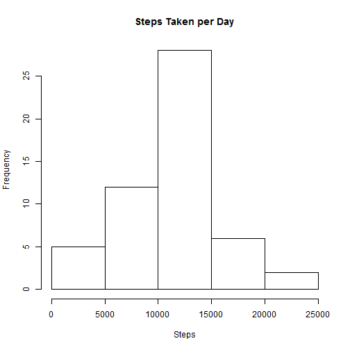
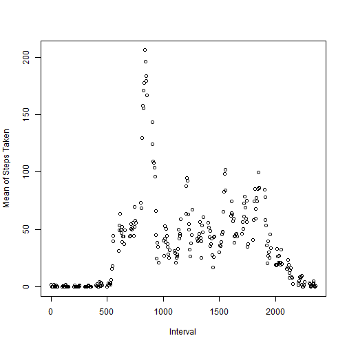
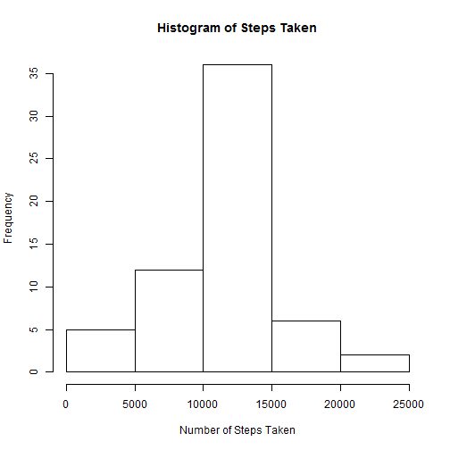
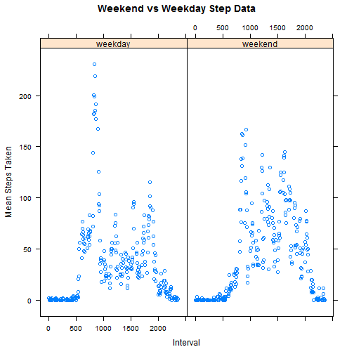

###Loading and Preprocessing the Data

* First, we will load the data into R and transform dates


```r
data <- read.csv("activity.csv", header = TRUE, sep =",")
data$date <- as.Date(data$date)
```


###What is Mean Total Number of Steps Taken Per Day?

* We will use plyr package to find sum of steps taken per day and create a histogram for steps taken per day


```r
library(plyr)
datasums <- ddply(data, .(date), summarize, steps = sum(steps))
hist(datasums$steps, main = "Steps Taken per Day", xlab = "Steps")
```

 

* Now we can calculate the mean and median of steps taken each day


```r
mean1 <- mean(datasums$steps, na.rm = TRUE)
options(scipen=999)
median1 <- median(datasums$steps, na.rm = TRUE)
```

**The mean number of steps taken per day is 10766.1886792 and the median number of steps is 10765**


###What is the Average Daily Activity Pattern?

* Create a time series plot of the 5-minute intervals averaged across all days


```r
summaryint <- ddply(data, .(interval), summarize, mean = mean(steps, na.rm = TRUE))
plot(summaryint$interval, summaryint$mean, xlab = "Interval", ylab = "Mean of Steps Taken")
```

 

* Which 5 Minute Interval contains the max number of steps


```r
maxmean <- subset(summaryint, summaryint$mean == max(summaryint$mean))
```
**The maximum average number of steps occurs at interval 835 with 206.1698113 average steps**

###Inputing Missing Values


```r
data$missing <- is.na(data$steps)
```

**The total number of rows with NA is 2304 rows.**

* Now we will fill in the missing values of the dataset by setting each missing interval to the average overall for that interval for all days


```r
df <- merge(data, summaryint, by.x = "interval", by.y = "interval")
df <- df[order(df$date),]
for(i in 1:length(df$missing)){
  if(df$missing[i]){
  df$steps[i] <- df$mean[i]
  }
}
```

* Histogram of the new data set and create mean and median measures for complete data


```r
compsum <- ddply(df, .(date), summarize, sum = sum(steps), mean = mean(steps), median = median(steps))
hist(compsum$sum, main = "Histogram of Steps Taken", xlab = "Number of Steps Taken")
```

 

```r
mean2 <- mean(compsum$sum)
options(scipen=999)
median2 <- median(compsum$sum)
```

**The mean number of steps in the completed data set is 10766.1886792 and the median number of steps is 10766.1886792**

The differences of the means was 0 between the 2 data sets because we used the interval averages to fill in the missing values. 

The differences of the medians was 1.1886792 between the data sets. The median converged to the average because of the way we inputed values for NA. The days missing were assigned the average value for that day (which is near the median) so it makes sense the mean and median are the same. **For this example, imputing the averages over the missing values did very little at all** 

###Are There Differences in Activity Patterns Between Weekdays and Weekends? 

First we will split the days into either a week or weekends category


```r
df$weekday <- weekdays(df$date)
for(i in 1:length(df$weekday)){
    if(df$weekday[i] == "Saturday"){
        df$weekday1[i] <- "weekend" 
    } else if(df$weekday[i] == "Sunday") {
        df$weekday1[i] <- "weekend"
    } else {
        df$weekday1[i] <- "weekday"
    }
}
```

* Now we subset our data into week and weekend and create our panel graph in lattice. 


```r
library(lattice)
weeksplit <- ddply(df, .(interval, weekday1), summarize, mean = mean(steps))
xyplot(mean~interval | factor(weekday1), data = weeksplit, main = "Weekend vs Weekday Step Data", xlab = "Interval", ylab = "Mean Steps Taken")
```

 
